## Overview:
This repository implements two different models: a VGG-based supervised learning model, and a SimCLR based contrastive learning model, for classifying nuclei patches. The nuclei patches have been extracted from a subset of the [PUMA dataset](https://puma.grand-challenge.org/dataset/). 

## Environment setup:
- Create a virtual environment using any tool (`venv`, `conda` etc).
- Activate the created virtual environment.
- Install requirements listed in the `requirements.txt` file.

## Files

Purpose of files:
- `config.py`: constants
- `dataloader.py`: dataloader utils and classes
- `evaluation.py`: function to evaluate a model on the test set
- `plots.py`: utils for plotting
- `simclr.py`: SimCLR model architecture, utils and training script
- `transforms.py`: Transformation utils for data augmentation
- `utils.py`: Common utility functions
- `vgg.py`: VGG model architecture, utils and training script

## Dataset:
The dataset contains images of nuclei patches, divided into three classes: tumor, histiocyte and lymphocyte. Each image has dimensions of 100 x 100, with zero padding. There are a total of 2100 images, 700 per class. The patches are also grouped into two different sample types: primary samples and metastatic samples.

<table>
  <tr>
    <td>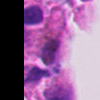</td>
    <td>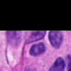</td>
    <td>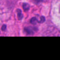</td>
    <td>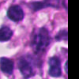</td>
  </tr>
  <tr>
    <td>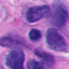</td>
    <td>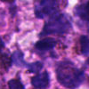</td>
    <td>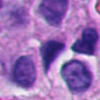</td>
    <td>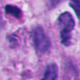</td>
  </tr>
</table>

## Training:
### VGG-based model:
<table>
  <tr>
  <th>Accuracy Plot
  </th>
  <th>
  Loss Plot
  </th>
  </tr>

  <tr>
    <td>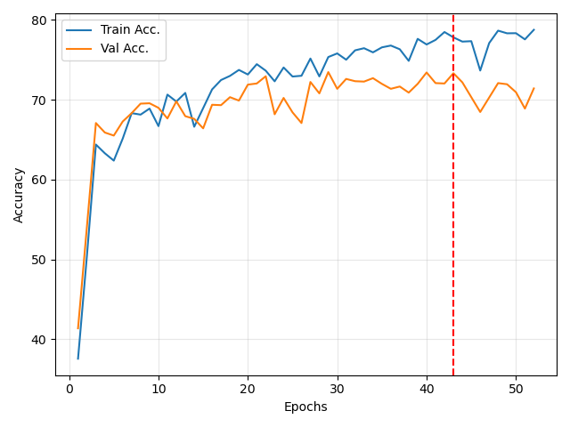</td>
    <td>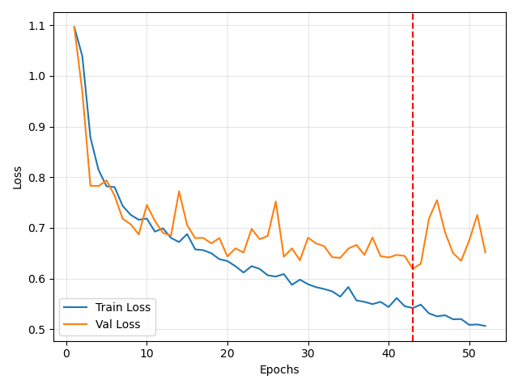</td>
  </tr>
</table>

### SimCLR-based model:
#### Pretraining:

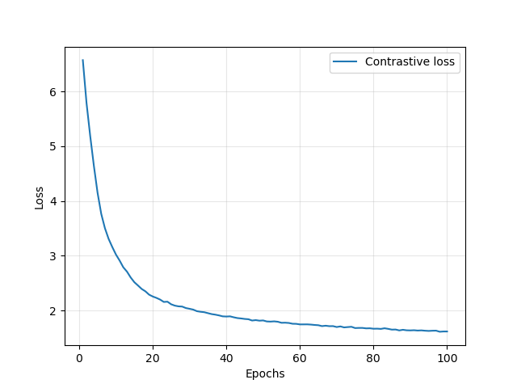

#### Finetuning:
<table>
  <tr>
  <th>Accuracy Plot
  </th>
  <th>
  Loss Plot
  </th>
  </tr>

  <tr>
    <td>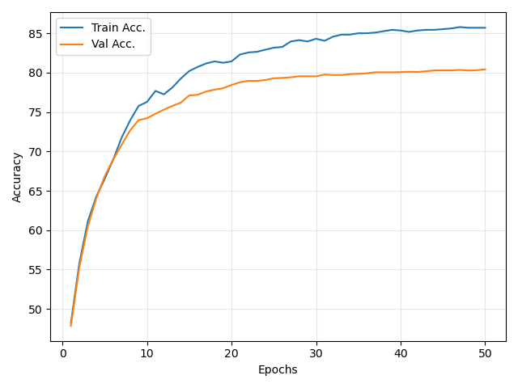</td>
    <td>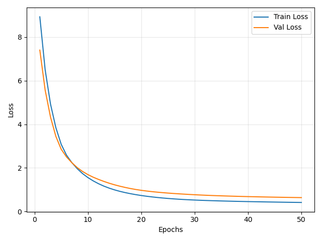</td>
  </tr>
</table>

## Results:
### Comparison:
#### Overall:
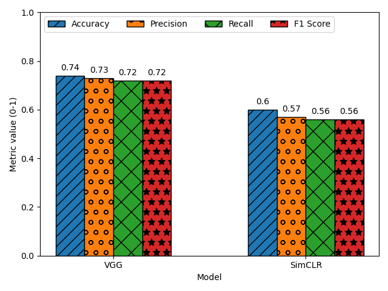

### Sample type:
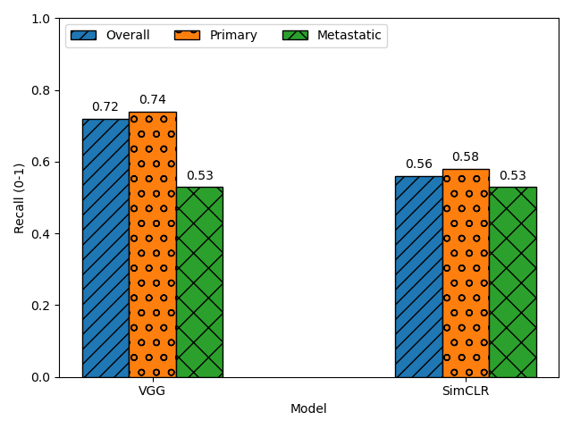

### VGG-based model:
#### Confusion matrix:
<table>
  <tr>
  <th>Overall
  </th>
  <th>
  Primary samples
  </th>
    
  <th>
  Metastatic samples
  </th>
  </tr>

  <tr>
    <td>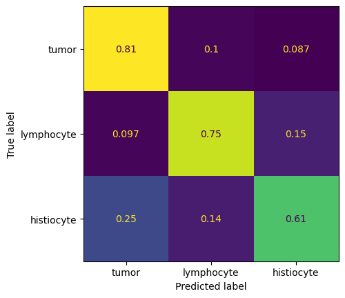</td>
    <td>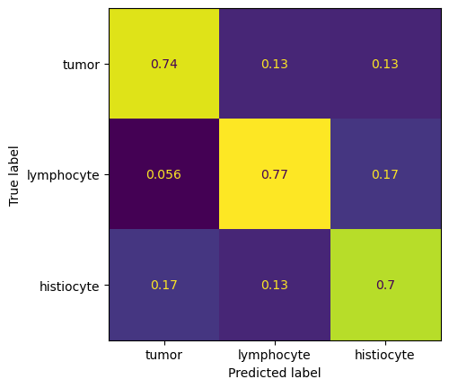</td>
    <td>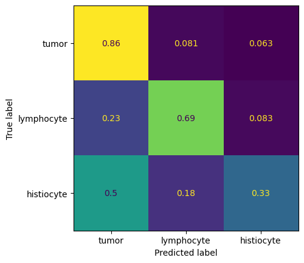</td>
  </tr>
</table>

### SimCLR-based model:
#### Latent space visualisation (t-SNE):
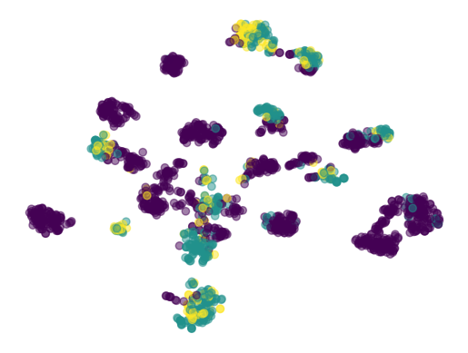

#### Confusion matrix:
<table>
  <tr>
  <th>Overall
  </th>
  <th>
  Primary samples
  </th>
    
  <th>
  Metastatic samples
  </th>
  </tr>

  <tr>
    <td>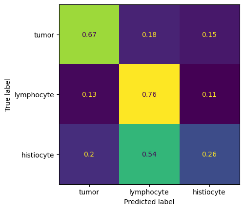</td>
    <td>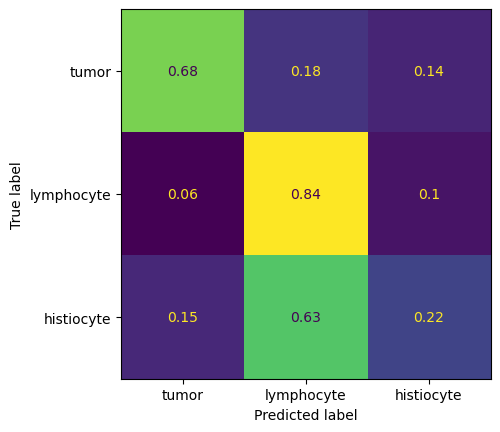</td>
    <td>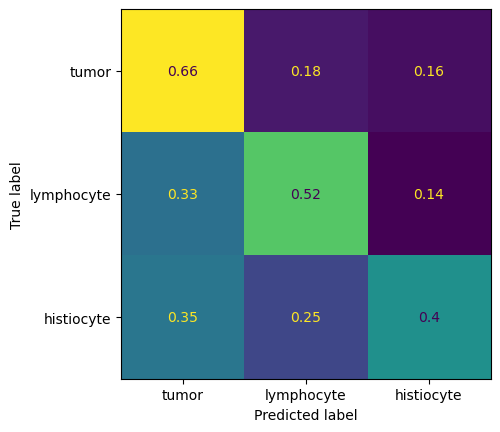</td>
  </tr>
</table>
